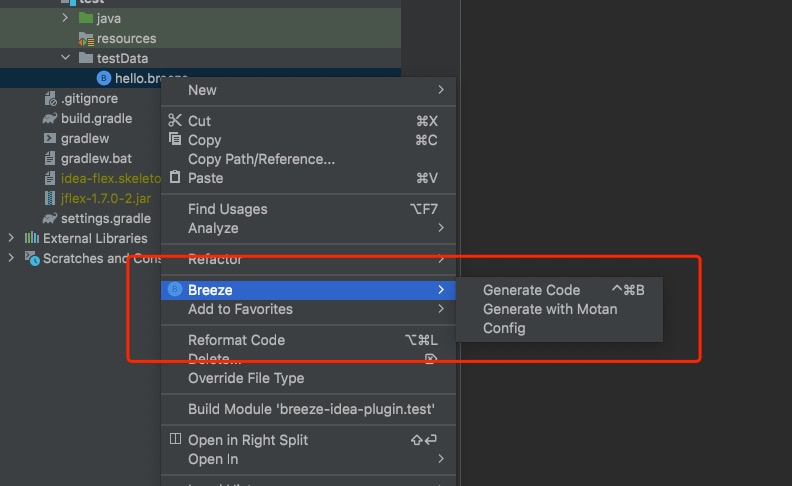
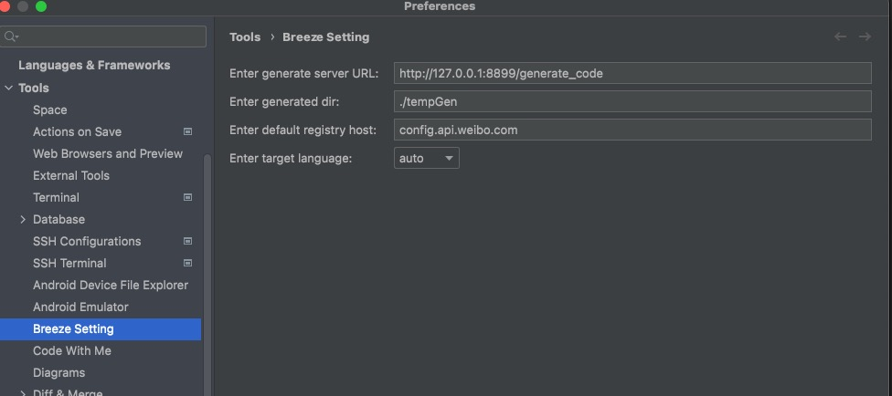

# BreezeHelper

BreezeHelper是用来辅助编辑[Breeze](https://github.com/weibreeze/breeze) schema文件并生成不同语言类代码的Intellij Platform插件。Breeze Helper支持IDEA，GoLand，CLion，PhpStorm，PyCharm等Intellij平台的各种语言开发IDE。

BreezeHelper 主要支持下列特性：

- Breeze schema文件(*.breeze文件)编辑
    - 文件格式化
    - 关键字自动补全
    - 语法高亮
    - PSI解析
    - Structure展示
- 多语言代码生成
    - 支持Java、Go、PHP、C++、Lua等语言
    - Message对象类生成
    - Service类生成（目前仅支持java）
- 支持[Motan](https://github.com/weibocom/motan) RPC
    - 支持XML，YAML格式Motan配置生成
    - 支持自动生成Motan常用配置

## 插件使用方式
### 1. 安装插件

    1. 从JetBrains Marketplace 中下载。 
    
    （待提供）
    
    2. 从[Release](https://github.com/weibreeze/breeze-idea-plugin/releases)中下载压缩包
    
    从Release的Assets中下载对应版本的zip压缩包，直接拖拽到IDE的编辑区即可。

插件安装后，以`.breeze`为扩展名的文件回显示`B`文件图标，在*.breeze文件或者包含breeze文件的目录上右键，可以看到Breeze菜单。

### 2. 使用插件

#### 配置插件

BreezeHelper
插件的代码生成能力来自[breeze-generator](https://github.com/weibreeze/breeze-generator),需要由breeze-generator提供http服务用来生成不同语言代码及配置。

因此使用BreezeHelper的生成功能前，需要先设置breeze-generator的http服务地址及生成语言相关设置。可以在`Preferences -> Tools -> Breeze Setting`
进行配置，也可以使用右键菜单中的`Breeze -> Config`进行配置。 配置页面如下图

配置项说明：
- generate server URL： 生成服务的http地址
- generated dir:        生成文件的目录。如果不进行设置，默认会作为项目源代码放到项目路径下（例如，java会放在`src/main/java/`目录的对应包名目录下）；如果使用相对路径比如`./`则表示相对于于项目（project）或者模块（module）的根目录。
- default registry host：默认注册中心的host，该值会出现在关键词补全提示及Motan默认配置MotanConfig的自动创建中。
- target language：选择要生成的目标语言，一次只能生成一种语言的类代码。默认（auto）会根据IDE检测需要生成的语言类型（TODO）

#### 使用插件生成代码或配置文件

在.breeze文件上或者文件夹目录上右键选择`Breeze`菜单，选择`Generate Code`或者`Generate with Motan`来生成Breeze消息类或者Motan RPC配置。

#### 生成默认MotanConfig

在breeze文件的编辑区中，右键选择`Generate...`菜单，可以选择生成默认的Motan Config。一个breeze文件只能包含一个name叫做`MotanBasicConfig`的config项。
